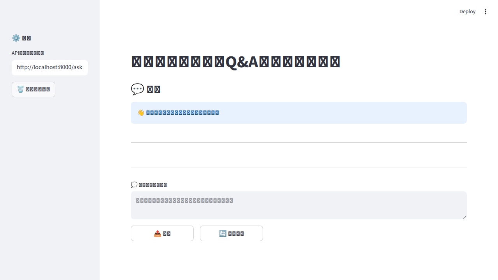

# docqa-portal – Internal Document Q&A Bot (RAG)

A prototype chatbot that enables natural language queries across internal documents such as manuals, FAQs, and meeting minutes using Retrieval-Augmented Generation (RAG).

## ✨ Features

- 📄 **Document Support**: Markdown (`.md`) and PDF (`.pdf`) files
- 🔪 **Smart Chunking**: Text splitting for optimal vector search
- 🧠 **Vector Embeddings**: OpenAI Embedding API integration
- 🔍 **Fast Search**: FAISS-powered similarity search
- 💬 **AI-Powered Answers**: OpenAI Chat API for response generation
- 🚀 **REST API**: FastAPI endpoint (`/ask`)
- 🖥️ **Web UI**: Simple Streamlit-based interface

## 📸 Demo



## 🛠️ Tech Stack

- **Python** 3.11+
- **FastAPI** / Uvicorn
- **Streamlit**
- **OpenAI API** (Chat + Embeddings)
- **FAISS** (faiss-cpu)
- **pypdf** (PDF processing)
- **python-dotenv**


## 📦 Installation

#### 1. Clone the repository

```bash
git clone https://github.com/joker082200/docqa-portal.git
cd docqa-portal
```

#### 2. Create virtual environment

```bash
python -m venv .venv

# Windows PowerShell
.\.venv\Scripts\Activate.ps1

# Mac/Linux
source .venv/bin/activate
```

#### 3. Install dependencies

```bash
pip install -r requirements.txt
```

#### 4. Set up environment variables

```bash
cp .env.example .env
```

Edit `.env` and add your OpenAI API key:

```env
OPENAI_API_KEY=your_api_key_here
```

#### 5. Prepare documents

Place your Markdown (`.md`) or PDF (`.pdf`) files in the `data/raw/` directory.

## 🔨 Build Index

Generate vector index from documents:

```bash
# Windows
.\.venv\Scripts\python.exe -m src.ingestion.build_index

# Mac/Linux
python -m src.ingestion.build_index
```


This creates a FAISS index from all `.md` and `.pdf` files in `data/raw/` and saves it to `data/vectorstore/`.

⏱️ **Note**: Processing ~600 chunks takes approximately 10-20 minutes. Progress is displayed during execution.

## 🚀 Run Application

#### Start API Server

```bash
# Windows
.\.venv\Scripts\python.exe -m uvicorn src.api.main:app --reload

# Mac/Linux
uvicorn src.api.main:app --reload
```

API available at: `http://localhost:8000`

#### Start Web UI

```bash
# Windows
.\.venv\Scripts\streamlit.exe run src/ui/app.py

# Mac/Linux
streamlit run src/ui/app.py
```

Open your browser and navigate to: `http://localhost:8501`

## 📂 Project Structure

```
docqa-portal/
├── README.md
├── requirements.txt
├── .env.example
├── .gitignore
├── docs/
│   └── design.md
├── data/
│   ├── raw/              # Place documents here (.md, .pdf)
│   └── vectorstore/      # Generated index files
│       ├── index.faiss
│       └── metadata.json
├── src/
│   ├── config.py
│   ├── models/
│   │   ├── embedder.py
│   │   └── llm_client.py
│   ├── ingestion/
│   │   ├── load_docs.py
│   │   ├── split_docs.py
│   │   └── build_index.py
│   ├── rag/
│   │   ├── retriever.py
│   │   └── qa_chain.py
│   ├── api/
│   │   └── main.py
│   └── ui/
│       └── app.py
└── scripts/
    ├── ingest_all.sh
    └── run_app.sh
```

## 🐛 Troubleshooting

#### Japanese Path Issue

FAISS library cannot handle paths containing Japanese characters. This project implements a workaround by temporarily changing the working directory.

#### Virtual Environment Conflicts

If both `venv` and `.venv` exist, use only `.venv`:

```bash
# Remove old venv (optional)
rm -rf venv  # Mac/Linux
Remove-Item -Recurse -Force venv  # Windows PowerShell
```

## 📝 License

MIT
